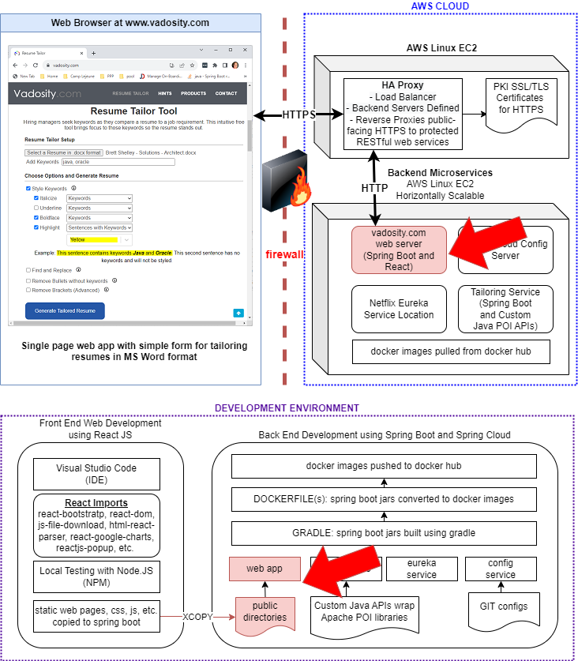

# WebApp Components

The red arrows indicate how this project's build artifacts fit into the Resume-Tailor application architecture

</img>

Quick Start Commands: Build React App, Spring Web, Docker Container, and Launch

	cd \dev\myapp
	npm run build
	xcopy .\build C:\dev\resume-tailor-webapp\public /E /H /C /I /Y
	xcopy .\build C:\dev\resume-tailor-webapp\src\main\resources\static /E /H /C /I /Y
	cd \dev\resume-tailor-webapp
	gradle clean build
	docker build -t resumetailor/resume-tailor-webapp:1.1 .
	cd \dev\resume-tailor-service
	docker compose up
	

To build locally:
	
	gradle clean build

To start this on Windows:

java -DSPRING_PROFILES_ACTIVE=development -DSPRING_CLOUD_CONFIG_URI=http://localhost:8888/ -DSPRING_CONFIG_IMPORT=optional:configserver:http://localhost:8888/ -DEUREKA_CLIENT_SERVICEURL_DEFAULTZONE=http://localhost:8761/eureka -jar .\build\libs\resume-tailor-webapp-1.0.jar

build docker image

	docker build -t resumetailor/resume-tailor-webapp:1.1 .
	
run docker image - 8000 is debug port

	docker run -d -p 80:80 -p 8000:8000 resumetailor/resume-tailor-webapp:1.1
	
run docker image with access to docker host (localhost)

	docker run -d -p 80:80 -p 8000:8000 --add-host=host.docker.internal:host-gateway resumetailor/resume-tailor-webapp:1.1

From within running image, curl a running config svc on the docker host:  (running in docker or otherwise)

	curl http://host.docker.internal:8888/resume-webapp-service/development/	
